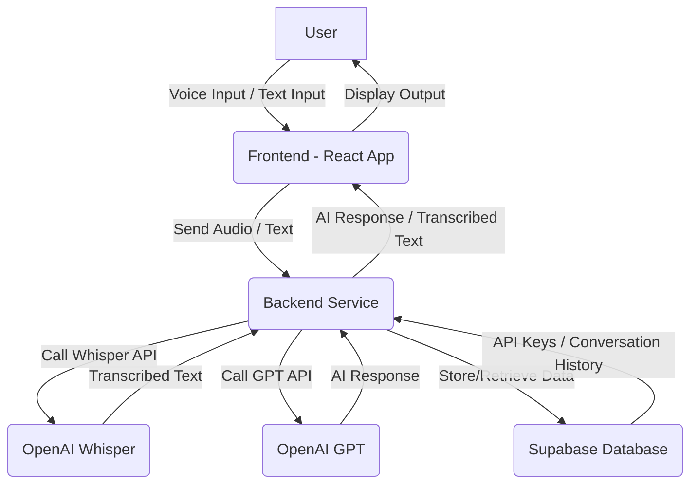

# AI Assistant and Whisper Integration Architecture Plan

## 1. Overview

This document outlines the proposed architecture for integrating an AI assistant and OpenAI Whisper voice transcription into the existing Human Light Mode React application. The goal is to provide users with an intelligent conversational agent and the ability to interact with it via voice commands, while ensuring secure API key management and robust data persistence with Supabase.

## 2. Key Architectural Components

Based on the research, the following key components will be involved:

*   **Frontend (React/TypeScript):** The existing Human Light Mode application will be extended to include UI elements for the AI assistant chat interface, voice input, and a settings panel for API key management.
*   **Backend (Node.js/Express or similar):** A new backend service will be introduced to handle sensitive operations such as OpenAI API calls (for both AI assistant and Whisper), secure API key storage, and interaction with Supabase. This is crucial for security, as exposing API keys directly in the frontend is highly discouraged.
*   **OpenAI Whisper API:** Used for converting spoken language (audio) into text.
*   **OpenAI GPT (or other LLM) API:** Used for generating AI assistant responses based on user input.
*   **Supabase:** A backend-as-a-service platform that will provide database capabilities (PostgreSQL), authentication, and potentially real-time features for conversation history.

## 3. AI Assistant Integration Approach

Several resources highlighted the importance of a backend for secure AI assistant integration [1, 2]. The frontend will send user messages (text or transcribed voice) to the backend. The backend will then make the necessary calls to the OpenAI GPT API, process the responses, and send them back to the frontend. This approach ensures that the OpenAI API key is never exposed client-side.

## 4. Voice Transcription with Whisper

For voice transcription, the `use-whisper` React hook [3] or similar client-side libraries can be used for recording audio. However, the actual transcription using the OpenAI Whisper API should occur on the backend to protect the API key [4, 5]. The frontend will capture audio, send it to the backend, and the backend will then forward it to the Whisper API for transcription. The transcribed text will then be used as input for the AI assistant.

## 5. Secure API Key Management

User-provided OpenAI API keys will be stored securely. Supabase offers robust features for secure API key management, including Row Level Security (RLS) and PostgreSQL roles [6, 7]. The API keys will be stored in the Supabase database, encrypted at rest. When a user makes a request that requires an OpenAI API key, the backend will retrieve the key from Supabase based on the authenticated user's ID.

## 6. Supabase Data Model (Initial Draft)

### `users` table (Supabase Auth will manage this, but we might extend it)

*   `id`: UUID (Primary Key, linked to Supabase Auth user ID)
*   `openai_api_key`: TEXT (Encrypted, nullable - users can choose to provide their own key)

### `conversations` table

*   `id`: UUID (Primary Key)
*   `user_id`: UUID (Foreign Key to `users.id`)
*   `created_at`: TIMESTAMP

### `messages` table

*   `id`: UUID (Primary Key)
*   `conversation_id`: UUID (Foreign Key to `conversations.id`)
*   `sender`: ENUM (‘user’, ‘ai’)
*   `content`: TEXT
*   `timestamp`: TIMESTAMP

## 7. Architectural Diagram (Conceptual)

## 8. Rationale

This architecture prioritizes security by keeping API keys and direct API calls on the backend. It leverages Supabase for scalable and secure data management, including user-specific API keys and conversation history. The modular design allows for independent development and scaling of frontend and backend components.

## References

[1] OpenAI Whisper React/Node.js Tutorial: Sound to Text ... - YouTube. https://www.youtube.com/watch?v=S0wurZ3VRjs
[2] Build a Speech-to-text Web App with Whisper, React and Node. https://www.sitepoint.com/speech-to-text-whisper-react-node/
[3] chengsokdara/use-whisper - GitHub. https://github.com/chengsokdara/use-whisper
[4] Getting Started With OpenAI's Whisper API And Node.js | Medium. https://medium.com/@marius.obert/unleashing-the-power-of-openai-whisper-api-for-audio-transcription-with-node-js-aeba6df03299
[5] Setting Up a TypeScript Environment for OpenAI's Whisper API. https://codesignal.com/learn/courses/getting-started-with-openai-whisper-api/lessons/setting-up-a-typescript-environment-for-openais-whisper-api
[6] The Ultimate Guide to Secure API Key Management in Supabase ... https://makerkit.dev/blog/tutorials/supabase-api-key-management
[7] Understanding API keys | Supabase Docs. https://supabase.com/docs/guides/api/api-keys

