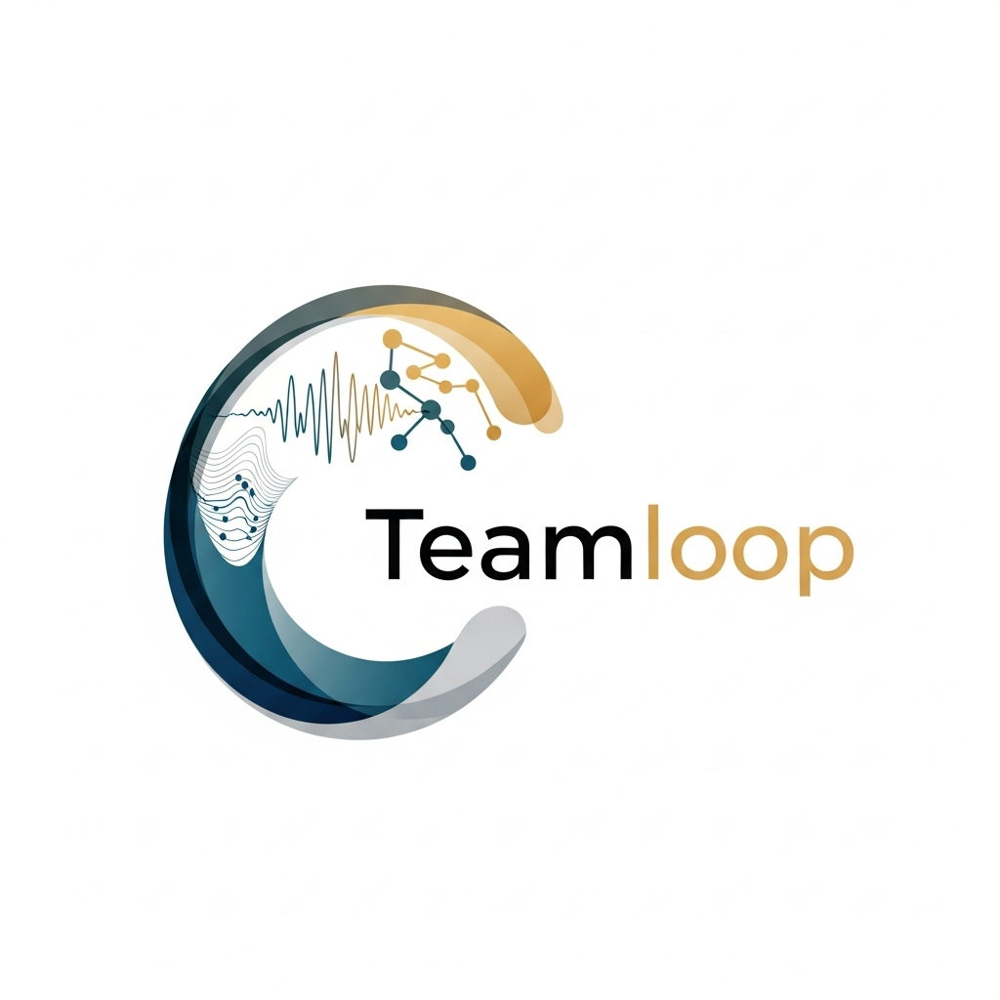

# 🚀 Teamloop - AI-Powered Employee Management Platform

<div align="center">
  
  
  [](https://opensource.org/licenses/MIT)
  [](https://www.typescriptlang.org/)
  [](https://reactjs.org/)
  [](https://tailwindcss.com/)
</div>

## 📖 Overview

**Teamloop** is a cutting-edge, AI-powered employee management platform that revolutionizes how modern teams handle HR operations. Built with React, TypeScript, and advanced AI technologies, Teamloop combines intelligent chat assistance, voice transcription, and comprehensive employee management tools into one seamless platform.

### ✨ Key Features

- 🤖 **AI-Powered Chat Assistant** - OpenAI GPT integration for intelligent HR support
- 🎤 **Voice AI & Transcription** - OpenAI Whisper for real-time voice-to-text
- 🔊 **Advanced Text-to-Speech** - ElevenLabs integration for natural voice output
- 👥 **Employee Management** - Complete lifecycle management with AI insights
- 📊 **Intelligent Analytics** - AI-driven insights and performance tracking
- 🎨 **Modern UI/UX** - Beautiful, responsive design with dark/light mode
- 🔒 **Secure Authentication** - JWT-based security with role management
- 📱 **Mobile-First Design** - Optimized for all devices and screen sizes

## 🏗️ Architecture

```
Teamloop/
├── Frontend (React + TypeScript)
│   ├── AI Chat Interface
│   ├── Voice Transcription
│   ├── Employee Dashboard
│   └── Settings & Configuration
├── Backend (Node.js + Express)
│   ├── OpenAI Integration
│   ├── ElevenLabs TTS
│   ├── Authentication
│   └── API Endpoints
└── Database (PostgreSQL)
    ├── User Management
    ├── Conversation History
    └── Employee Data
```

## 🚀 Quick Start

### Prerequisites

- **Node.js** 18+ and **npm** 9+
- **OpenAI API Key** for GPT and Whisper
- **ElevenLabs API Key** for enhanced TTS
- **Modern browser** with ES6+ support

### Installation

1. **Clone the repository**
   ```bash
   git clone https://github.com/your-username/teamloop.git
   cd teamloop
   ```

2. **Install dependencies**
   ```bash
   npm install
   ```

3. **Configure environment variables**
   ```bash
   cp env.teamloop.md .env.local
   # Edit .env.local with your API keys
   ```

4. **Start the development server**
   ```bash
   npm run dev
   ```

5. **Open your browser**
   Navigate to `http://localhost:8081`

## 🌐 Live Demo

**Try Teamloop Live:** [http://your-app-name.s3-website-us-east-1.amazonaws.com](http://your-app-name.s3-website-us-east-1.amazonaws.com)

The live demo showcases the complete Teamloop experience with AI-powered features and modern UI/UX design.

## ⚙️ Configuration

### Environment Variables

Create a `.env.local` file in the project root:

```env
# API Configuration
VITE_API_BASE_URL=http://localhost:3001

# OpenAI Configuration
VITE_OPENAI_API_KEY=your_openai_api_key_here

# ElevenLabs Configuration
VITE_ELEVENLABS_API_KEY=your_elevenlabs_api_key_here
VITE_ELEVENLABS_VOICE_ID=your_preferred_voice_id

# Database Configuration (Pending PM Decision)
VITE_SUPABASE_URL=your_supabase_url
VITE_SUPABASE_ANON_KEY=your_supabase_anon_key
```

### API Keys Setup

1. **OpenAI API Key**
   - Visit [OpenAI Platform](https://platform.openai.com/api-keys)
   - Create a new API key
   - Add to your `.env.local` file

2. **ElevenLabs API Key**
   - Visit [ElevenLabs](https://elevenlabs.io/)
   - Sign up and get your API key
   - Add to your `.env.local` file

## 🎨 Branding & Design

### Color Palette

Teamloop uses a carefully crafted color scheme that reflects our brand identity:

- **Primary Teal** `#2C5F7A` - Dark teal/blue for main elements
- **Secondary Gray** `#A8BCC7` - Light gray/blue for secondary elements  
- **Accent Gold** `#D4AF37` - Gold/orange for highlights and CTAs

### Typography

- **Font Family**: Inter, Segoe UI, Roboto, Helvetica Neue, Arial
- **Team Text**: Bold (700) weight for emphasis
- **Loop Text**: Regular (400) weight for balance

## 🛠️ Development

### Available Scripts

```bash
# Development
npm run dev          # Start development server
npm run build        # Build for production
npm run preview      # Preview production build

# Code Quality
npm run lint         # Run ESLint
npm run type-check   # TypeScript type checking
```

### Project Structure

```
teamloop/
├── src/                    # Source code
│   ├── components/         # Reusable UI components
│   │   ├── ui/            # shadcn/ui components
│   │   ├── Header.tsx     # Main navigation
│   │   ├── Hero.tsx       # Landing hero section
│   │   ├── Features.tsx   # Feature showcase
│   │   └── Footer.tsx     # Site footer
│   ├── pages/             # Page components
│   │   ├── Index.tsx      # Landing page
│   │   ├── ChatPage.tsx   # AI chat interface
│   │   └── SettingsPage.tsx # User settings
│   ├── lib/               # Utility libraries
│   │   ├── api.ts         # API client
│   │   └── utils.ts       # Helper functions
│   ├── hooks/             # Custom React hooks
│   ├── assets/            # Images and static files
│   └── index.css          # Global styles and CSS variables
├── dist/                   # Production build (generated)
├── public/                 # Static assets
├── human-light-mode-backend/ # Backend API server
└── docs/                   # Documentation files
```

### Component Development

All components follow a consistent pattern:

- **TypeScript interfaces** for props
- **Tailwind CSS** for styling
- **shadcn/ui** for base components
- **Responsive design** principles
- **Accessibility** best practices

## 🚀 Deployment

### S3 Static Website Hosting

Teamloop is deployed to AWS S3 for production hosting:

1. **Build the application**
   ```bash
   npm run build
   ```

2. **Deploy to S3**
   ```bash
   aws s3 sync dist/ s3://your-app-name --delete
   ```

3. **Access your live site**
   Navigate to: `http://your-app-name.s3-website-us-east-1.amazonaws.com`

### Environment Requirements

- **AWS CLI** configured with appropriate permissions
- **S3 bucket** configured for static website hosting
- **Bucket policy** allowing public read access

## 🔧 Backend Setup

### Prerequisites

- **Node.js** 18+ and **npm** 9+
- **Database** (PostgreSQL/MongoDB - pending PM decision)

### Installation

1. **Navigate to backend directory**
   ```bash
   cd human-light-mode-backend
   ```

2. **Install dependencies**
   ```bash
   npm install
   ```

3. **Configure environment**
   ```bash
   cp .env.example .env
   # Edit .env with your configuration
   ```

4. **Start the server**
   ```bash
   npm run dev
   ```

## 📱 Features in Detail

### AI Chat Assistant

- **Real-time conversations** with OpenAI GPT
- **Context-aware responses** for HR-specific queries
- **Conversation history** and management
- **Multi-language support**

### Voice AI & Transcription

- **High-accuracy transcription** with OpenAI Whisper
- **Natural TTS output** with ElevenLabs
- **Real-time processing** for live conversations
- **Multiple voice options** and customization

### Employee Management

- **Complete employee profiles** and data
- **Performance tracking** and analytics
- **Onboarding workflows** and automation
- **Document management** and storage

## 🚧 Current Status

### ✅ Completed
- [x] Frontend UI/UX redesign
- [x] Teamloop branding implementation
- [x] AI chat interface
- [x] Voice transcription components
- [x] Responsive design system
- [x] Dark/light mode support
- [x] Component library setup

### 🔄 In Progress
- [ ] Backend API integration
- [ ] Authentication system
- [ ] Production deployment

### 📋 Planned
- [ ] User management system
- [ ] Advanced analytics dashboard
- [ ] Mobile app development
- [ ] API documentation
- [ ] Performance optimization

## 🤝 Contributing

We welcome contributions! Please see our [Contributing Guidelines](CONTRIBUTING.md) for details.

### Development Workflow

1. **Fork** the repository
2. **Create** a feature branch
3. **Make** your changes
4. **Test** thoroughly
5. **Submit** a pull request

### Code Standards

- **TypeScript** for type safety
- **ESLint** for code quality
- **Prettier** for formatting
- **Conventional commits** for messages

## 📄 License

This project is licensed under the MIT License - see the [LICENSE](LICENSE) file for details.

## 🆘 Support

### Getting Help

- **Documentation**: Check this README and component docs
- **Issues**: [GitHub Issues](https://github.com/your-username/teamloop/issues)
- **Discussions**: [GitHub Discussions](https://github.com/your-username/teamloop/discussions)
- **Email**: hello@teamloop.com

### Common Issues

- **Port conflicts**: Change port in `vite.config.ts`
- **API errors**: Verify environment variables
- **Build failures**: Clear `node_modules` and reinstall

## 🙏 Acknowledgments

- **OpenAI** for GPT and Whisper APIs
- **ElevenLabs** for advanced TTS capabilities
- **shadcn/ui** for beautiful component library
- **Tailwind CSS** for utility-first styling
- **Vite** for fast development experience

## 📞 Contact

- **Website**: [teamloop.com](https://teamloop.com)
- **Email**: hello@teamloop.com
- **Twitter**: [@Teamloop](https://twitter.com/teamloop)
- **LinkedIn**: [Teamloop](https://linkedin.com/company/teamloop)

---

<div align="center">
  <strong>Built with ❤️ by the Teamloop Development Team</strong>
  
  [](https://teamloop.com)
</div>
